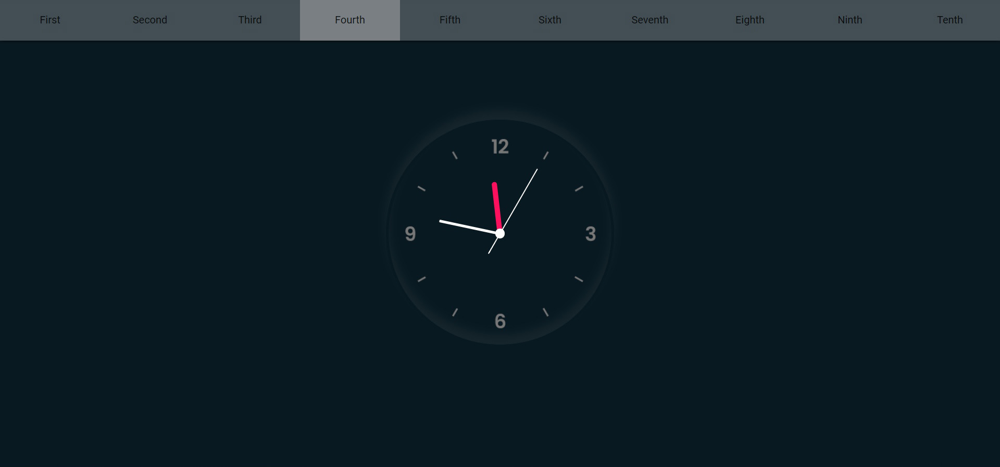

# Animations
**Animations** - проект, в котором собрано 10 интересных CSS & Js анимаций

## Getting Started
```
$ npm install  
$ npm dev
```
### Используемые технологии
- HTML 5/ SCSS
- JavaScript
- Vue, nuxt (использованы для удобства)

### Как это выглядит:





